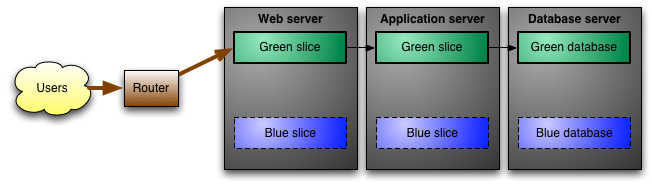

## Blue-Green Deployment

Minimize downtime - The blue-green deployment approach ensures that there are two identical production environments. At any time one of them is live. When developers prepare a new release of the software, they do the final stage of testing in one environment. Once it works, developers switch the router so that all incoming requests go to that environment - the other one is idle.

Rollback - If anything goes wrong, just switch the router back to the other environment. 
 
### Complete git/hook setup

### Create blue/green infrastructure

### Demonstrate /switch route

### Demonstrate migration of data on switch

### Demonstrate mirroring
